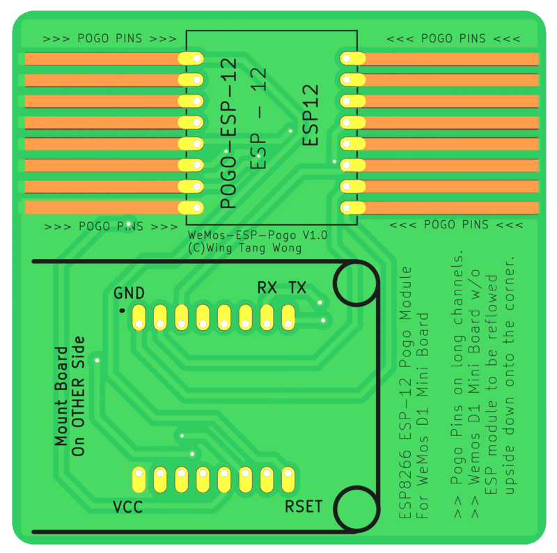
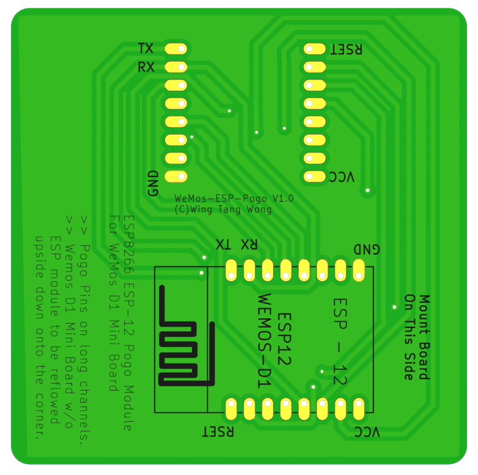

# ESP8266 Programming D1 Mini Pogo Jig V2

This board makes use of a WemosD1Mini (ESP8266 version) board as a USB->SERIAL adapter to flash
ESP-12 modules via POGO pins.

* [Eagle Files](EAGLE)
* [KiCAD Files](KICAD)
* [Gerber/Drill Production Files](PRODUCTION_FILES)
* [Gerber/Drill Production File ZIP](PRODUCTION_FILES/ESP12_Harness.zip)

# Version 2 - Changelog

* Imported [Eagle CAD](EAGLE) files into [KiCAD 6.x](KICAD) and did some cleanup:
  * Rerouted some paths so that they weren't right on top of each other.
  * Fixed an import bug to make sure that the pogo traces show up.
  * Fixed the silkscreen on some footprints so that DRC passes without warnings.
* Exported Gerber and Drill files for the Version 2 design from KiCAD: [Production Files](PRODUCTION_FILES) / [Production File ZIP](PRODUCTION_FILES/ESP12_Harness.zip)

# Original Version 1 - Changelog

* Originally Designed in [Eagle CAD](EAGLE)
* Circuit works, but traces were pretty close together
* The masking configs don't port to KiCad very well, so creating a version 2 that is done using [KiCAD](KICAD)
* Silkscreens are all over the place. lulz.

This is a board designed to take a WeMos D1 Mini board(with the ESP module removed) and use it as a USB interface with built-in reset/flash
functionality for bare ESP8266 modules similar to the ESP-12 units.

The PCB was drawn up in Eagle and I have successfully gotten them manufactured through OshPark.

They are designed to be used with Pogo pins. I STRONGLY recommend the mushroom head type. 

The D1 Mini board is to be mated to the PCB in a manner similar to ball grid array: add solder to the pads where the ESP module was to give it a bump.

Rest the board on the PCB within the outline with the bumps facing their matching set of pads and heat from below with a hot air gun. When the solder
melts, the boards will come together. Presuming no bridges, you should be good to go.

# Gotchas

* Don't install the pogo pins too far in. Otherwise, you'll never get the ESP module installed.
* Don't get flux or solder onto the pin portion of the pogo pin... this will ruin them.
* Don't use low temp solder paste... tried this route and was a PITA.
* You can solder the pogo pins individually... but I had the best luck with 2 runs of solder paste on the end away from the pin side and placing the pins in place and using hot air to reflow the solder. This works great.
